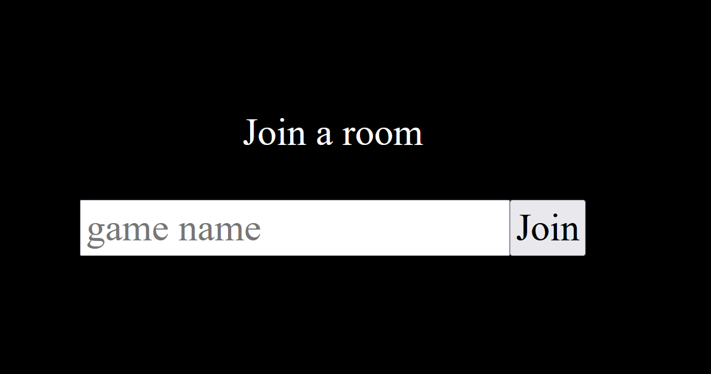
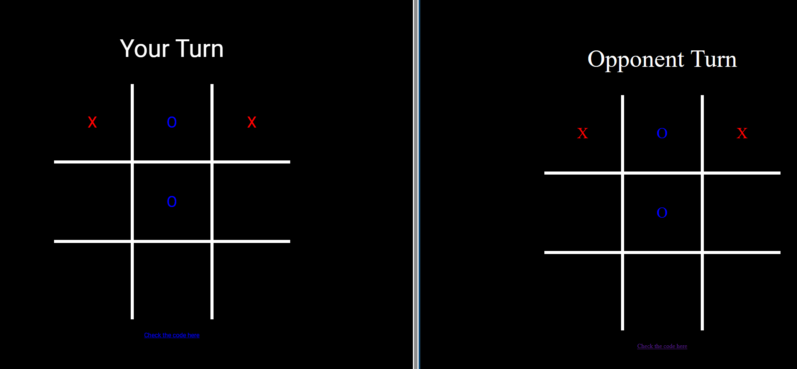

# Multiplayer Ti-Tac-Toe

Tic-tac-toe game using Websocket for the multiplayer functionality.

It supports 2 connections and any new connection after that will be dropped.

---

## Development

The client part uses plain HTML/CSS and Javascript and for backend it use Cloudflare worker as the websocket server.

In order to run this project you need:

1. Cloudflare account( free plan can be used for local development)
2. Node.js v18

run `npm install`  to install all dependencies

Authenticate the wrangler app to the cloudflare account using `npx wrangler login`

Verify the authentication using `npx wrangler whoami`

start websocket server using `npx wrangler dev`

The client need configuratio located in `client/js/config.js` and  there is template you can use in `client/js/config-template.js`

In order to run the client you can use VS Code live server extension or run `node server.js` (this will open localhost:3000)

## Deployment

**Warning** the Cloudflare worker use Durable Object which require paid plan!

run command `npx wrangler deploy` to deploy websocket server

for client, just host everything under `client` folder and don't forget to adjust `WEBSOCKET_URL` value in `client/js/config.js`

## How to play
open the app in two different browsers/device to play

make sure both player enter the same room (case sensitive)

you can play

